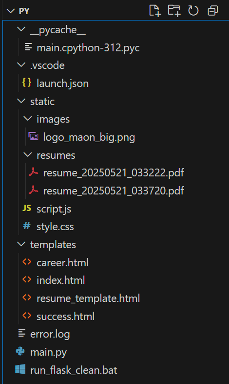
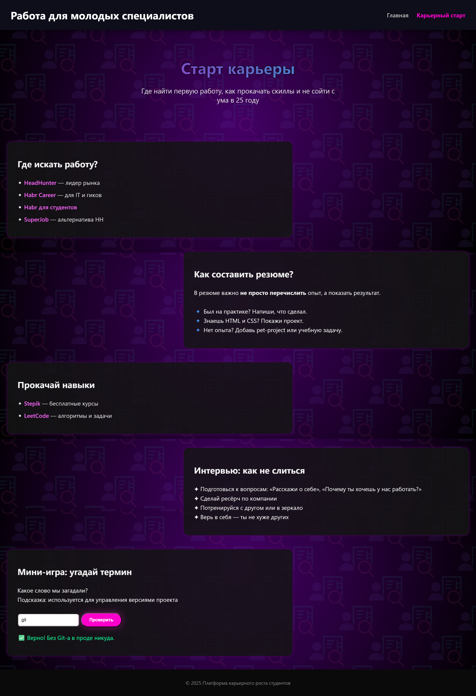

# Resume Creator – Руководство разработчика

**Resume Creator** – учебный проект по созданию собственного веб-сервера и приложения для генерации резюме в PDF. В данном руководстве пошагово описана реализация проекта: от создания простого HTTP-сервера на Python до внедрения расширенных возможностей (веб-интерфейс, форма, Flask, PDF). Приведены фрагменты кода, схемы и пояснения для всех этапов разработки, включая выполненные модификации.

---

## Шаг 1: Настройка окружения проекта

Перед началом разработки необходимо подготовить окружение:

- **Python 3:** Убедитесь, что установлен Python версии 3.x (проект разрабатывался на Python 3).
- **Библиотеки:** Установите необходимые пакеты – как минимум, микрофреймворк Flask и библиотеку `pdfkit` для генерации PDF. Проще всего это сделать через `pip`:

  ```bash
  pip install flask pdfkit
  ```

> **Примечание:** библиотека `pdfkit` является обёрткой для утилиты `wkhtmltopdf`, поэтому для корректной генерации PDF нужно **отдельно установить `wkhtmltopdf`** (доступен на официальном сайте, в Ubuntu – через `apt install wkhtmltopdf`).  
> После установки убедитесь, что путь к исполняемому файлу `wkhtmltopdf` указан в конфигурации `pdfkit`.

---

## Структура проекта

Создайте рабочую директорию для проекта, например `ResumeCreator/`. Внутри неё будут размещены файлы приложения:

- **Python-скрипт сервера:** `main.py`
- **HTML-шаблоны:** директория `templates/`
- **Статические файлы:** директория `static/`
- **Скрипт запуска:** (необязательно) `run_flask_clean.bat`

### Пример структуры файлов:

```
ResumeCreator/  
├── main.py                   # Основной Python-файл с кодом сервера (Flask-приложение)  
├── templates/                # Директория HTML-шаблонов  
│   ├── index.html            # Главная страница с формой резюме  
│   ├── career.html           # Страница "Карьерный старт" с советами  
│   ├── resume_template.html  # Шаблон резюме для PDF-генерации  
│   └── success.html          # Страница успешного создания резюме  
├── static/                   # Статические файлы (CSS, JS и пр.)  
│   ├── style.css             # Стили оформления веб-приложения  
│   ├── script.js             # Клиентский JavaScript-скрипт  
│   └── resumes/              # Папка для сохранения сгенерированных PDF-файлов  
│       └── ... (*.pdf)       # PDF-файлы резюме (генерируются во время работы)  
└── run_flask_clean.bat       # Скрипт для запуска сервера в Windows (по желанию)
```

*Рис. 1 – Общая структура проекта ResumeCreator в редакторе VS Code.*

---

Убедившись, что все зависимости установлены и структура создана, можно приступать к разработке.

## Шаг 2: Проектирование архитектуры (клиент–серверная схема)

Приложение строится по модели **«клиент–сервер»**. Ниже представлена общая схема работы **Resume Creator**:

На схеме отображён цикл взаимодействия:

1. Браузер пользователя (клиент) отправляет HTTP-запрос на сервер.
2. Сервер обрабатывает запрос, при необходимости генерирует контент (например, PDF-файл) и возвращает ответ.
3. Затем браузер может сделать дополнительные запросы (например, запросить скачивание PDF).
4. Сервер отвечает на эти запросы.

Таким образом, **фронтенд** (интерфейс в браузере) и **бэкенд** (серверное приложение на Python) обмениваются данными через HTTP.

### Основные элементы архитектуры:

- **Браузер (клиентская часть):**  
  Загружает HTML-страницы, показывает форму для ввода данных резюме, отправляет данные формы на сервер и отображает результаты (например, скачанный PDF).  
  В нашем проекте логика на клиенте усилена JavaScript-кодом (для отправки данных без перезагрузки страницы и интерактивности интерфейса).

- **Самодельный веб-сервер на Python:**  
  Изначально реализует базовую функциональность: умеет принимать подключения по TCP, читать HTTP-запросы и отвечать текстом (HTML-кодом страниц).  
  Мы начнём с создания такого сервера «с нуля», чтобы понять основы работы HTTP.

- **Flask-приложение:**  
  Облегчает реализацию сложных частей. После ручной реализации основы мы подключим Flask для обработки маршрутов, шаблонов и форм.  
  Flask возьмёт на себя сетевую работу, а мы сосредоточимся на логике приложения (генерация резюме и т.д.).

- **PDF-генератор:**  
  Внешняя утилита (`wkhtmltopdf`) в связке с `pdfkit`, которая используется сервером для преобразования HTML-шаблона резюме в настоящий PDF-файл.  
  Это компонент, работающий на стороне сервера по запросу.

---

Разработав концепцию и выбрав стек технологий, переходим непосредственно к реализации.

## Шаг 3: Создание базового HTTP-сервера (на чистом Python)

**Цель шага:** написать минимальный HTTP-сервер, который умеет принимать одно соединение и возвращать простой ответ. Это помогает понять устройство веб-сервера “под капотом”.

Создадим файл `main.py` (пока без Flask, просто используя модуль `socket`). В него впишем код, устанавливающий сокет-сервер:

```python
import socket

# Настройки сервера
HOST = '0.0.0.0'      # слушать на всех интерфейсах (localhost)
PORT = 8000           # порт для сервера

# Создаём TCP-сокет
server_socket = socket.socket(socket.AF_INET, socket.SOCK_STREAM)
server_socket.setsockopt(socket.SOL_SOCKET, socket.SO_REUSEADDR, 1)
server_socket.bind((HOST, PORT))
server_socket.listen(1)
print(f"Listening on port {PORT}...")

# Бесконечный цикл ожидания подключений
while True:
    client_connection, client_address = server_socket.accept()
    request = client_connection.recv(1024).decode()   # читаем запрос (не более 1024 байт)
    print("Получен запрос:\n", request)              # выводим запрос в консоль (для отладки)

    # Формируем простой HTTP-ответ
    http_response = "HTTP/1.0 200 OK\n\nHello, World!"
    client_connection.sendall(http_response.encode()) # отправляем ответ клиенту
    client_connection.close()                         # закрываем соединение
```

Запустив этот скрипт (`python main.py`), мы поднимаем локальный сервер на порту `8000`.

Если теперь в браузере открыть адрес `http://localhost:8000/`, сервер ответит строкой **“Hello, World!”**. Браузер отобразит эту строку, поскольку она помещена в тело HTTP-ответа.

Мы также выводим содержимое запроса (`GET / HTTP/1.1` и заголовки), что в консоли позволяет увидеть, какие данные посылает браузер.

На этом этапе сервер очень примитивен: на любой запрос он возвращает одну и ту же строку. Следующая задача – научить его отдавать реальную страницу из файла.

## Шаг 4: Раздача статической страницы (index.html)

Теперь расширим сервер, чтобы он читал содержимое HTML-файла и отдавал его.

Создадим в папке проекта директорию (например, `htdocs/` или воспользуемся `templates/`) и разместим там файл `index.html` – простой HTML-документ с приветствием.

Для начала пойдёт содержимое из примера:

```html
<!-- templates/index.html -->
<html>
<head><title>Hello World</title></head>
<body>
  <h1>Hello, World!</h1>
  <p>Это главная страница нашего сервера.</p>
</body>
</html>
```

Изменим код сервера: вместо жёсткой строки он должен возвращать содержимое этого файла:

```python
# ... предшествующий код создания socket ...
while True:
    client_connection, addr = server_socket.accept()
    request = client_connection.recv(1024).decode()
    # (пропускаем вывод запроса для краткости)

    # Читаем файл index.html и формируем ответ
    try:
        with open("templates/index.html", "r", encoding="utf-8") as fin:
            content = fin.read()
        response = "HTTP/1.0 200 OK\n\n" + content
    except FileNotFoundError:
        response = "HTTP/1.0 404 NOT FOUND\n\nPage not found."

    client_connection.sendall(response.encode())
    client_connection.close()
```

Теперь сервер при запросе будет открывать и читать `templates/index.html`.

- Если файл найден – он возвращается с кодом **200**.
- Если по какой-то причине не найден – отдается сообщение **“Page not found”** с кодом **404**.

Можно перезапустить сервер и проверить: браузер отобразит содержимое HTML-страницы (включая заголовок `<h1>` и абзацы).

> Обратите внимание: мы пока не анализируем, какой ресурс запросил браузер – мы просто всегда читаем `index.html`.  
> В действительности браузер может запросить и другой URL. На следующем шаге реализуем разбор запроса.

## Шаг 5: Поддержка нескольких страниц и обработка 404

Реальный сервер должен уметь возвращать разные страницы в зависимости от URL (например, `/about.html` или другой путь).  
Для этого парсим первую строку HTTP-запроса, где содержится метод и путь. Обычно строка запроса выглядит так:

```
GET /somepage.html HTTP/1.1
```

Добавим разбор пути и сделаем сервер универсальным:

```python
# ... код внутри цикла при получении запроса ...
# Парсим первую строку запроса, извлекаем название запрашиваемого файла
headers = request.split('\n')
if headers:
    # Первая строка: метод и путь
    parts = headers[0].split()
    if len(parts) >= 2:
        method, path = parts[0], parts[1]
    else:
        method, path = "GET", "/"
else:
    method, path = "GET", "/"

# Если запрошен корневой путь '/', подставляем index.html
if path == "/":
    filename = "index.html"
else:
    filename = path.lstrip("/")  # убираем ведущий слеш

# Открываем запрашиваемый файл (в директории templates/)
try:
    with open(f"templates/{filename}", "r", encoding="utf-8") as fin:
        content = fin.read()
    response = "HTTP/1.0 200 OK\n\n" + content
except FileNotFoundError:
    # Файл не найден – возвращаем 404 ошибку
    error_message = "<h1>404 Not Found</h1><p>Запрошенная страница не найдена</p>"
    response = "HTTP/1.0 404 NOT FOUND\n\n" + error_message

client_connection.sendall(response.encode())
client_connection.close()
```

Теперь логика такая:

- Из запроса извлекается путь (например, при запросе `/career.html` переменная `filename` станет `"career.html"`).
- Если путь равен `/` (главная страница), заменяем его на `index.html` по умолчанию.
- Пробуем открыть соответствующий файл в папке `templates`. Если успех – читаем и отправляем его содержимое.
- Если нет – отдаем простую HTML-страницу с сообщением 404.

Можно протестировать, создав дополнительный файл, например `templates/career.html`, и обратившись к нему через браузер:  
[http://localhost:8000/career.html](http://localhost:8000/career.html)

Сервер должен выдать его содержимое.  
А запрос к несуществующему ресурсу (например: [http://localhost:8000/abc.html](http://localhost:8000/abc.html)) вернёт нашу заготовку 404.

---

На этом этапе у нас получился примитивный HTTP/1.0 сервер, способный обслуживать простейшие HTML-страницы. Мы реализовали основу, на которой далее построим функциональное приложение.

## Шаг 6: Переход к Flask для обработки запросов (модификация)

Продолжать наращивать функциональность на чистых сокетах становится затруднительно – например, обрабатывать данные форм (метод POST) вручную гораздо сложнее.  
Поэтому следующим шагом мы переходим на фреймворк **Flask**.

Flask избавит нас от низкоуровневых деталей: мы не будем сами вызывать `socket.accept()` или парсить HTTP-строки – вместо этого опишем маршруты и логику, а все сетевые операции возьмёт на себя встроенный сервер Flask.

---

### Интеграция Flask

- Устанавливаем Flask (если не сделали ранее):  
  ```bash
  pip install flask
  ```

- Импортируем Flask и необходимые модули в `main.py`:

  ```python
  from flask import Flask, request, render_template, url_for, send_from_directory, jsonify
  import pdfkit, os, logging
  from datetime import datetime
  ```

- Инициализируем Flask-приложение:

  ```python
  app = Flask(__name__)
  ```

---

### Переносим логику маршрутов

- Главный маршрут `/` теперь описывается декоратором `@app.route('/')`:

  ```python
  @app.route('/')
  def home():
      return render_template('index.html')
  ```

  Здесь используется Flask-шаблонизация: функция `render_template` найдёт файл `templates/index.html`, подставит в него нужные параметры (если переданы) и вернёт готовый HTML.

---

### Остальные страницы

- **Маршрут страницы “Карьерный старт”:**

  ```python
  @app.route('/career')
  def career():
      return render_template('career.html')
  ```

- **Страница успеха (будет содержать ссылку на файл):**

  ```python
  @app.route('/success')
  def success():
      file_url = request.args.get('file')  # читаем параметр из URL
      return render_template('success.html', file=file_url)
  ```

  Переменную `file` потом используем в шаблоне для вставки ссылки.

---

### Обработка статики

Flask автоматически обслуживает файлы из папки `static/`,  
поэтому пути к стилям/скриптам можно прописывать так:

```html
<link rel="stylesheet" href="{{ url_for('static', filename='style.css') }}">
```

---

### Запуск приложения

```python
if __name__ == "__main__":
    app.run(debug=False)
```

При запуске Flask автоматически поднимет локальный сервер (по умолчанию на порту 5000).

---

Теперь наше приложение работает в среде Flask, и дальнейшие усовершенствования будем делать уже в рамках этого фреймворка.

---

### Проверка

1. Запустите `main.py`.
2. Откройте в браузере [http://localhost:5000/](http://localhost:5000/) – должна загрузиться главная страница.
3. Перейдите на `/career` – отобразится страница “Карьерный старт”.

> По сути, мы получили тот же результат, что был на сыром сокете, но с минимальными усилиями, благодаря Flask.  
> (На данном этапе можно отключить или удалить код, написанный для socket-сервера, чтобы он не конфликтовал с Flask. В итоговом варианте приложения используется только Flask-маршрутизация.)

## Шаг 7: Разработка HTML-интерфейса (страницы и форма резюме)

Перейдём к созданию реального интерфейса. Главная страница будет содержать форму для ввода данных резюме, а страница успеха – сообщение об успешной генерации.  
Также у нас есть контентная страница “Карьерный старт” с советами (для демонстрации многостраничности).

---

### Главная страница (`index.html`)

Находится в папке `templates/`. Она включает:

- Шапку сайта (**header**) с названием и навигационным меню.
- Блок приветствия (**hero**) с заголовком и описанием.
- Форму резюме – центральный элемент, использующий тег `<form>` с полями ввода:
  - `<input type="text" name="name" placeholder="ФИО" required>` – поле для имени (Фамилия Имя Отчество).
  - Аналогичные поля для:
    - `position` – желаемая должность
    - `experience` – опыт работы
    - `education` – образование
    - `email` – контактная информация
  - `<textarea name="skills" placeholder="Навыки (через запятую)" required></textarea>` – многострочное поле для навыков.
  - `<button type="submit">Сгенерировать резюме</button>` – кнопка для отправки формы.
- Подвал сайта (**footer**) с копирайтом.


*Рис. 2 – Визуальный вид главной страницы с формой для резюме.*

#### Фрагмент формы из `index.html`:

```html
<form class="resume-form" id="resumeForm">
  <input type="text" name="name" placeholder="ФИО" required>
  <input type="text" name="position" placeholder="Желаемая должность" required>
  <input type="text" name="experience" placeholder="Опыт работы" required>
  <textarea name="skills" placeholder="Навыки (через запятую)" required></textarea>
  <input type="text" name="education" placeholder="Образование" required>
  <input type="text" name="email" placeholder="Контактная информация" required>
  <button type="submit">Сгенерировать резюме</button>
</form>
```

> Каждому полю задан атрибут `name` – он определяет, под каким ключом это значение придёт на сервер. Эти же имена потом используются в Flask (например, `request.form['name']`).

---

### Страница “Карьерный старт” (`career.html`)

Содержит несколько разделов с информацией:

- **Список ресурсов**, где искать работу (HeadHunter, Habr Career и т.д. – с гиперссылками).
- **Советы по составлению резюме** (с подстрочными пояснениями и выделениями).
- **Советы по улучшению навыков** (ссылки на Stepik, LeetCode).
- **Блок “Интервью: как не растеряться”** с рекомендациями.
- **Мини-игра**:  
  Небольшой интерактив – поле ввода с вопросом “Какой термин мы загадали? (подсказка: система контроля версий)”.  
  Пользователь вводит ответ и нажимает кнопку; через JavaScript происходит проверка.  
  Это сделано для развлечения и демонстрации возможностей JS.

---

Обе страницы (`index.html` и `career.html`) используют общий стиль:

- Подключают `style.css` и `script.js`
- Имеют общую **шапку** и **подвал**
- В шаблонах используется механизм навигации: класс `"active"` ставится у ссылки, соответствующей текущей странице (вручную или через JS)


*Рис. 3 – Контентная страница с рекомендациями и мини-игрой.*

---

После вёрстки страниц можно открыть главную страницу через Flask-сервер и убедиться, что форма и контент отображаются правильно.

> **Пример интерфейса главной страницы:**  
> Пользователь видит заголовок и форму с полями для ввода информации резюме. После заполнения этих полей будет задействован скрипт для отправки данных на сервер.

## Шаг 8: Обработка отправки формы и AJAX-взаимодействие

После того как форма создана, нужно реализовать её обработку. Есть два подхода:

1. **Обычная отправка формы:** при нажатии кнопки браузер выполняет переход по указанному в форме `action` (если не указан – по текущему URL) методом POST, и сервер возвращает новую страницу.
2. **Отправка через AJAX:** скрипт перехватывает событие, сам отправляет запрос на сервер, получает ответ и на его основе обновляет интерфейс.

Мы выбрали второй путь (**AJAX**) для лучшего UX.

---

### Реализация

Форма на странице не имеет атрибута `action` и обрабатывается нашим `script.js`.

#### Фрагмент кода JavaScript (`script.js`):

```javascript
// script.js
const resumeForm = document.getElementById("resumeForm");
if (resumeForm) {
  resumeForm.addEventListener("submit", function (e) {
    e.preventDefault();  // отменяем стандартную отправку формы

    const formData = new FormData(this);
    // Проверка заполненности всех полей
    const allFilled = [...formData.values()].every(v => v.trim() !== "");
    if (!allFilled) {
      alert("Пожалуйста, заполните все поля.");
      return;
    }

    // Отправляем POST-запрос на сервер по адресу /generate
    fetch("/generate", {
      method: "POST",
      body: formData
    })
      .then(response => {
        if (!response.ok) throw new Error("Ошибка сервера");
        return response.json();           // ожидаем JSON ответ
      })
      .then(data => {
        if (data.success && data.fileUrl) {
          // Перенаправляем пользователя на страницу успеха, передав URL файла как параметр
          window.location.href = `/success?file=${encodeURIComponent(data.fileUrl)}`;
        } else {
          alert("Не удалось создать резюме.");
        }
      })
      .catch(error => {
        console.error("Ошибка при отправке:", error);
        alert("Произошла ошибка при отправке формы.");
      });
  });
}
```

---

### Разбор логики скрипта:

- Перехватываем событие `submit` формы `resumeForm`.
- `e.preventDefault()` предотвращает перезагрузку страницы.
- Собираем данные формы в объект `FormData`.
- Проверяем, что ни одно поле не пустое. Если есть пустые – выдаём `alert` и прекращаем отправку.
- Используем `fetch` для отправки запроса:
  - URL: `/generate` (соответствует маршруту Flask)
  - Метод: `"POST"`
  - Тело: `formData` – автоматически формирует `multipart/form-data`
- Затем обрабатываем ответ:
  - `response.json()` – преобразуем ответ в объект
  - Если `data.success === true` и есть `fileUrl`, делаем редирект на `/success?file=...`
  - Иначе — показываем сообщение об ошибке
- В случае ошибки запроса — срабатывает `catch`

---

### Что видит пользователь

Такая схема позволяет аккуратно обработать результат **без перезагрузки**:

- Пользователь либо увидит **страницу успеха**
- Либо сообщение об ошибке, оставаясь на текущей странице

---

### Диаграмма взаимодействия

1. Пользователь нажимает “Отправить”
2. Браузер (JS) посылает AJAX-запрос на `/generate`
3. Сервер обрабатывает запрос и возвращает JSON
4. Браузер получает `{ success: true, fileUrl }` и делает редирект на `/success?file=...`
5. Браузер запрашивает страницу `/success`
6. Сервер отдаёт HTML
7. На странице работает скрипт, отображающий ссылку на PDF
8. Пользователь кликает “Скачать резюме”
9. PDF-файл загружается

---

Теперь перейдём к **серверной части обработки запроса `/generate`**.

## Шаг 9: Реализация генерации PDF на сервере

Для обработки данных формы создадим маршрут в Flask. В `main.py` добавляем:

```python
@app.route('/generate', methods=['POST'])
def generate():
    # 1. Проверка и сбор данных из формы
    required_fields = ['name', 'email', 'position', 'education', 'skills']
    for field in required_fields:
        if not request.form.get(field):
            # Если какое-то обязательное поле пустое – возвращаем ошибку 400
            return jsonify({"success": False, "error": f"Поле '{field}' не заполнено."}), 400

    data = {
        'name': request.form['name'],
        'email': request.form['email'],
        'position': request.form['position'],
        'education': request.form['education'],
        'skills': request.form['skills'],
        'experience': request.form.get('experience', '')
    }

    # 2. Генерация имени файла и подготовка к сохранению
    filename = f"resume_{datetime.now().strftime('%Y%m%d_%H%M%S')}.pdf"
    filepath = os.path.join('static', 'resumes', filename)

    # 3. Генерация HTML из шаблона с данными
    rendered_html = render_template('resume_template.html', **data)

    # 4. Конвертация HTML -> PDF с помощью pdfkit (wkhtmltopdf)
    config = pdfkit.configuration(wkhtmltopdf=r"/usr/local/bin/wkhtmltopdf")  # путь к wkhtmltopdf
    pdfkit.from_string(rendered_html, filepath, configuration=config)

    # 5. Возврат успешного ответа с URL файла
    return jsonify({
        "success": True,
        "fileUrl": url_for('download_resume', filename=filename)
    })
```

---

### Пояснения к коду

**Шаг 1: Проверка формы**

- Убедимся, что все обязательные поля присутствуют.
- Если чего-то не хватает — возвращаем JSON с ошибкой и HTTP-кодом `400 Bad Request`.
- Собираем значения в словарь `data`.  
  Обратите внимание: `experience` может быть необязательным, поэтому используем `request.form.get('experience', '')`.

**Шаг 2: Имя и путь к PDF**

- Формируем уникальное имя файла на основе текущей даты и времени.
- Сохраняем файл в папке `static/resumes/`.
- Используем `os.makedirs(..., exist_ok=True)` выше по коду для создания папки при запуске.

**Шаг 3: Генерация HTML**

- С помощью `render_template()` формируем HTML-строку `rendered_html` из шаблона `resume_template.html`, подставляя данные из словаря `data`.

**Шаг 4: Конвертация HTML → PDF**

- Используем `pdfkit` и внешний инструмент `wkhtmltopdf`.
- Указываем путь к `wkhtmltopdf` в `pdfkit.configuration(...)`.
- Пример пути:
  - Linux: `/usr/local/bin/wkhtmltopdf`
  - Windows: `r"C:\Program Files\wkhtmltopdf\bin\wkhtmltopdf.exe"`
- Функция `from_string()` сохраняет PDF на диск.

**Шаг 5: Возврат результата**

- Возвращаем JSON с:
  - `success: true`
  - `fileUrl` — ссылка для скачивания PDF через маршрут Flask `download_resume`.

---

Маршрут `/generate` работает как API:

- **На вход:** данные формы
- **На выход:** JSON с результатом обработки (ссылка на файл или ошибка)

---

### Проверка

1. Перезапустите Flask-приложение.
2. Заполните форму на главной странице.
3. Нажмите "Отправить".
4. В консоли сервера появятся логи запроса.
5. В папке `static/resumes/` появится новый PDF-файл.
6. Браузер перенаправит на страницу успеха (`/success?file=...`).

Всё готово — теперь форма действительно создаёт резюме!

## Шаг 10: Скачивание PDF-файла и вывод страницы успеха

Последний шаг – **раздача PDF клиенту**.

---

### Маршрут для скачивания файла

Мы уже предусмотрели маршрут:

```python
@app.route('/resume/<filename>')
def download_resume(filename):
    # Отправляем файл из папки static/resumes пользователю, как вложение (attachment)
    return send_from_directory(RESUME_DIR, filename, as_attachment=True)
```

- `send_from_directory` упрощает отправку статических файлов.
- Flask сам добавляет заголовки `Content-Type: application/pdf` и `Content-Disposition: attachment`.
- Параметр `as_attachment=True` заставляет браузер **скачивать** файл, а не открывать.

---

### HTML-шаблон `success.html`

```html
<!-- success.html (фрагмент) -->
<h1>Резюме успешно создано!</h1>
<p>Вы можете скачать его и использовать при поиске работы</p>
<a id="downloadLink" class="button" download>Скачать резюме</a>

<script>
  const params = new URLSearchParams(window.location.search);
  const file = params.get("file");
  const downloadLink = document.getElementById("downloadLink");
  if (file && file.startsWith("/resume/")) {
    downloadLink.href = file;
  } else {
    downloadLink.textContent = "Ссылка на резюме не найдена";
    downloadLink.removeAttribute('download');
    downloadLink.classList.remove("button");
  }
</script>
```

---

### Как это работает

1. Пользователь попадает на страницу `/success?file=/resume/имя.pdf`
2. JS-скрипт извлекает параметр `file` из URL
3. Присваивает его как `href` ссылки `downloadLink`
4. Атрибут `download` подсказывает браузеру скачивать файл

В результате пользователь видит кнопку **“Скачать резюме”**, при клике на которую:

- Выполняется запрос по пути `/resume/resume_xxxx.pdf`
- Flask возвращает PDF
- Браузер сохраняет файл


*Рис. 4 – Уведомление об успешной генерации резюме с кнопкой скачивания.*

---

### Обработка ошибок

Если параметр `file`:

- отсутствует
- или не начинается с `/resume/`

тогда скрипт меняет текст кнопки на предупреждение и убирает её интерактивность.

---

### Итог

На этом основная функциональность завершена:  
**Резюме сгенерировано, передано клиенту и скачано пользователем.** 

Далее — резюме проекта и возможные улучшения.

## Дополнительные улучшения и модификации

Проект **Resume Creator** включает ряд дополнительных деталей, улучшающих опыт взаимодействия и качество кода:

---

### Логирование и обработка ошибок

- Используется модуль `logging` (например, запись ошибок в `error.log`).
- Потенциально проблемные участки (PDF-генерация, работа с файлами) обёрнуты в `try/except`.
- В случае ошибки:
  - Возвращается JSON `{"success": false, "error": "..."}`.
  - Подробности записываются в лог.
- Это предотвращает падение сервера и упрощает отладку.

---

### Навигация и активные ссылки

- В шапке сайта присутствуют ссылки **“Главная”** и **“Карьерный старт”**.
- Через JS текущая страница определяется автоматически.
- Активной ссылке добавляется класс `.active` для подсветки.
- Стиль `.active` выделяется цветом, улучшая UX.

---

### Анимации и визуальные эффекты

- В `style.css` и `script.js` реализованы:
  - **Градиентный заголовок** с тенью.
  - **Плавное появление карточек** при прокрутке (через `IntersectionObserver`).
  - **Наведение** на кнопки/карточки вызывает тень и масштабирование.
- Всё это делает интерфейс более живым и отзывчивым.

---

### Адаптивная вёрстка

- Используются **media-запросы** для экранов до 768px.
- Форма резюме перестраивается в **одну колонку**.
- Шрифты и отступы адаптируются.
- Интерфейс удобно использовать с телефона.

---

### Мини-игра на JS

- В `career.html` добавлена простая **угадайка**:
  - Вопрос: *“Какой термин мы загадали? (связано с управлением версиями)”*
  - Ответ: `git`
  - Успех: `Верно! Без Git-а в проде никуда.`
  - Ошибка: `Не угадал. Попробуй снова.`
- Это демонстрирует знание JS и добавляет интерактив.

---

### Чистота и структура кода

- Благодаря Flask:
  - Код организован по **маршрутам**, а не через один большой цикл.
  - Каждая функция (`home`, `career`, `generate`, `success`, `download_resume`) имеет свою ответственность.
- **CSS/JS** файлы вынесены в `static/`, **HTML** — в `templates/`.
- Принята практика раздельного хранения логики и представления.

---

## Заключение

Следуя данному руководству, можно воспроизвести проект **Resume Creator** и:

- Понять, как работают **веб-серверы на Python**
- Освоить **Flask** и **pdfkit**
- Практиковаться в создании форм, шаблонов, и AJAX-запросов

Проект демонстрирует:

- Обработку `GET` и `POST` запросов
- Использование HTML-шаблонов для генерации PDF
- Интеграцию внешних инструментов (`wkhtmltopdf`)
- Создание современного и удобного интерфейса на HTML/CSS/JS

---

В результате:  
**пользователь может за несколько секунд получить профессиональное резюме**, созданное динамически и готовое к скачиванию.  
